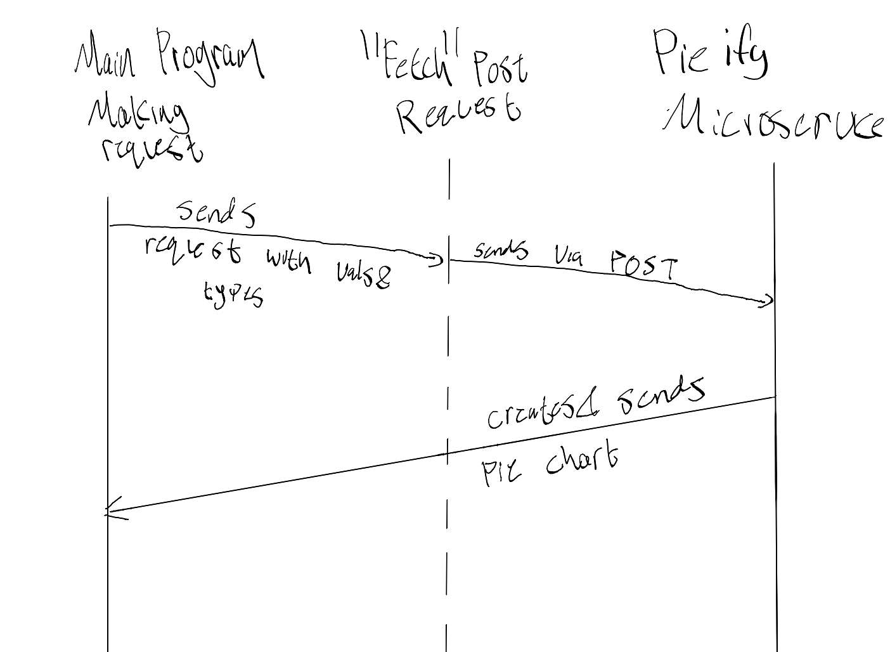

# README for microservice A
## Brief overview
This program is a simple nodejs server that users can send POST requests to for pie charts for simply typed data.

In addition, there is a testing html page and a js script to go along with it to test the pie chart creation.

### A) How to request data
First step is to set up the nodejs server.  
To start, download this repository somewhere onto your local machine and rund the following commands:  
```
npm init
npm install
node serve.js
```
This should display a message indicating that the pie chart server is running on your machine using port 3000. In order to request a pie chart you need to send a POST request to your localhost at port 3000 with a file extension "pieify". The POST request needs to contain a JSON file with the transaction types and values that you wish to pieify.  
In javascript this process should look something like:
```
vals = [1000,1000,1000];
types = ["Complications","Death","Taxes"]

fetch("http://localhost:3000/pieify", {
    method: "POST",
    headers: {
        "Content-Type": "application/json"
    },
    body: JSON.stringify({ vals, types })
})
```
Transaction types can be repeated as the server will handle compressing the numbers.  

### B) How to recieve data
Once you've requested a pie chart from the server, it will send back the pie chart along the same post connection. The chart will be a png file, so if you want to do anything with it using javascript you'll first have to convert it to a blob. Additionally, if you wish to display the image onto a webpage immediately, you will need to give it a imgurl so that your html can display it properly.  
```
fetch("http://localhost:3000/pieify", {
    method: "POST",
    headers: {
        "Content-Type": "application/json"
    },
    body: JSON.stringify({ vals, types })
}).then(response => response.blob()) // Convert response to a Blob
.then(blob => {
    const imgUrl = URL.createObjectURL(blob);
    let img = document.getElementById("resultImage");
    img.src = imgUrl; // Set image source
})
.catch(error => console.error("Error:", error));
```

### C) UML Diagram

